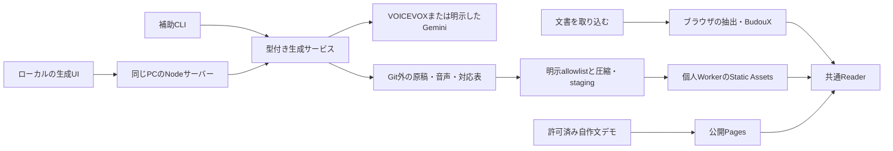

# アーキテクチャと実装範囲

React 19・Mantine 9・TanStack Start／Router・Vite・TypeScript・pnpmを使います。packageの固定versionは[web manifest](../../apps/web/package.json)、[lockfile](../../pnpm-lock.yaml)、[第三者notice](../licenses/README.md)で管理します。音声生成・保存音声のReader・静的配布出力を実装し、通過済みの範囲は検証記録へ記録します。

## 実行する場所

| profile | 用途 | データ・サーバー境界 |
| --- | --- | --- |
| local | 通常読書＋ブラウザから詳細生成 | 同じPCのNodeがenv、ジョブ、Engine/API、ファイルを管理。CLIも同じcoreを呼ぶ |
| pages | 自分の文書を取り込む公開トップ＋別ページの音声デモ | 静的UIと許可済みデモのみ。ローカル生成route・API・Node core・秘密を含めない |
| worker | 選択した個人の本をスマホへ配布 | 静的UI、本文、圧縮音声、manifestを配る。初期はR2不要。生成APIを登録しない |

通常取り込みは本文を外部送信しません。音声生成では送信先と発話原稿を計画画面で示し、有料API開始前に確認します。無料VOICEVOXは同じPCのloopbackだけへ接続し、失敗してもクラウドへ切り替えません。公開Readerは保存済み音声を読むだけです。

## 読書機能の構成

| 場所 | 責務 |
| --- | --- |
| [routes](../../apps/web/src/routes/)・[router.tsx](../../apps/web/src/router.tsx) | 取り込み・読書画面とprofileに応じた導線 |
| [model.ts](../../apps/web/src/reader/model.ts) | ブロック、フレーズ、元範囲、ルビ、表示設定の型 |
| [text-import.ts](../../apps/web/src/reader/text-import.ts) | TXTとMarkdown ASTから本文・構造・UTF-16元位置を抽出 |
| [segmentation.ts](../../apps/web/src/reader/segmentation.ts) | BudouX、書記素・数値・URL等の境界保護、安定ID・hash |
| [text-worker.ts](../../apps/web/src/reader/text-worker.ts)・[text-service.ts](../../apps/web/src/reader/text-service.ts) | 本文の前処理、進捗、取消、古い結果の無効化 |
| [pdf-import.ts](../../apps/web/src/reader/pdf-import.ts)・[pdf-view.ts](../../apps/web/src/reader/pdf-view.ts) | PDF.jsの文字層・座標、横書き1段の復元、元ページ描画 |
| [playback.ts](../../apps/web/src/reader/playback.ts)・[PlaybackProgress.tsx](../../apps/web/src/reader/ui/PlaybackProgress.tsx) | 黙読の単一タイマーと休止込み時間進捗 |
| [storage.ts](../../apps/web/src/reader/storage.ts) | 明示的なIndexedDB保存、検証、再開、削除 |
| [ReaderApp.tsx](../../apps/web/src/reader/ui/ReaderApp.tsx)・[PdfSource.tsx](../../apps/web/src/reader/ui/PdfSource.tsx) | 操作、原文、ルビ、元ページの近似ハイライト |

元位置はUTF-16の開始・終了です。PDFにはpage・item・item内範囲・rectを残します。長さが変わるMarkdownは`transformed`、PDF座標は`approximate`を記録します。表示の書記素数、元範囲の精度、音声alignmentの精度は別に扱います。[取り込みの契約](import-pipeline.md)と[分割の契約](segmentation.md)を参照してください。

本文抽出・BudouXはWorker、PDF解析はPDF.js Workerです。取消ではWorker/PDF taskを終了し、request番号で古い結果を無効にします。入力欄は固定高さで、全フレーズをDOM化しません。全ブロック・元本文・単位はメモリに保持するため、入力上限の全件で端末メモリを保証しません。

## 音声機能の追加箇所

生成サービスは`apps/web/src/generation`に置き、client-safeのDTOとserver-onlyの設定・保存・providerを分けます。ブラウザUIとCLIは同じ計画・キャッシュ・ジョブ処理を使用します。[ローカル生成の契約](local-generation.md)が安全境界と再開の正本です。ブラウザ入力からshell commandを組み立てません。

既存の`TextBlock.text / runs / ruby`と`ReadingUnit.start / end / sources`を表示側の正本にし、発話本文と読み辞書を別artifactへ保持します。NodeではTXT/Markdownのpure処理を再利用できます。PDFのVite固有`?url`・`BASE_URL`付きloaderはNodeへ直接importせず、ブラウザで確認した抽出結果をschema/hash検査して取り込みます。CLIのPDF対応はloaderの分離後に評価します。

読書と音声のcontrollerは[再生・同期の契約](playback.md)に従います。黙読CPMタイマーと音声時計を同時に動かしません。音声の元ファイル、対応表、圧縮物は独立キャッシュにし、圧縮・alignmentの修正ではTTSを再実行しません。

## 静的出力とスマホ

profileは`local / pages / worker`で分けます。Pagesのbaseは`/ripola/`、Workerは`/`を基準にします。profileごとのclient出力を`dist/<profile>/client`、静的配布用を`dist/distribution/<profile>`へ分離する構成です。入口HTML、route直リンク、PDF資材、Worker URL、manifest、QRのbaseを一致させます。build準備と実デプロイを区別します。

静的Readerは`manifest + ReadingDocument + audio chunks + timeline`を読む契約です。選択した`ReadingDocument`には`rawText`も含まれ、元ファイルを配らなくても本文artifactは原文を含みます。配布対象の全文を確認し、個人の入力を公開デモへ混ぜません。[配布設計](distribution.md)を参照してください。

QRは同じ本・revisionを開く通常HTTPS URLをブラウザ内で符号化します。PCのlocalhostやIndexedDBをQRだけでスマホへ転送することはできません。認証を使う配布ではスマホ自身が認証し、API keyやservice tokenをQRへ入れません。

R2、D1、SQL、KV、Durable Objects、Queue、cron、クラウドGPU、常駐クラウド生成サーバーは初期要件ではありません。ジョブはPCのファイル、配布蔵書はmanifest、読書位置はブラウザ保存で管理します。PWA、クラウド同期、人物認識、縦表示、OCRは未対応です。

## ローカルとクラウドの分担

現在はlocalで生成し、明示選択した完成assetをStatic Assetsへ一方向に配布します。公開先のAPI生成・永続蔵書・自動同期は未実装です。[機能分担・将来の保存と同期](local-cloud.md)に、ブラウザ保存のorigin境界、R2等を追加する条件、manifest/hashによる照合とlocalへの持ち帰り、競合・二重課金の防止案をまとめます。
