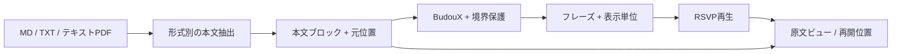

# PDF・Markdownの取り込みと原文位置

初期対応は**Markdown・TXT・貼り付けと、横書き1段のテキスト層付きPDF**です。本文と出典位置を一緒に作り、BudouXへ渡します。**OCRは初期スコープ外**です。画像PDFや抽出できないページは空の本にせず、説明とMD/TXT・貼り付けへの案内を出します。



## 中間モデルを先に決める

以下は設計用の型案で、実装済みコードではありません。

```ts
type SourceRange =
  | { kind: 'text'; startUtf16: number; endUtf16: number }
  | {
      kind: 'pdf'; pageNumber: number;
      itemIndex: number; itemStartUtf16: number; itemEndUtf16: number;
      quad?: number[]; // 元ページ座標。字単位矩形は近似の場合がある
    };

type TextBlock = {
  id: string;
  kind: 'paragraph' | 'heading' | 'listItem' | 'quote';
  text: string; // 解析用の正規化済み本文
  runs: Array<{
    startUtf16: number; endUtf16: number; source: SourceRange[];
    mapping: 'exact' | 'transformed' | 'approximate';
  }>;
  annotations: Array<{
    type: 'ruby' | 'emphasis' | 'link' | 'namedHighlight';
    startUtf16: number; endUtf16: number; value: string;
  }>;
};

type DocumentEvent =
  | { type: 'text'; block: TextBlock }
  | { type: 'staticBlock'; kind: 'code' | 'table' | 'math'; source: SourceRange[] }
  | { type: 'break'; kind: 'paragraph' | 'section' | 'page'; source: SourceRange[] };
```

元データは不変に保持し、改行結合・Unicode正規化・記号除去で生じた対応関係をrunsに記録します。UTF-16位置、Unicode code point数、表示用grapheme数を混同しません。1フレーズは複数のsource rangeを持てます。これはMarkdownの強調記号やPDFの複数TextItemをまたぐ場合に必要です。

単純な`rawText.indexOf(chunk)`を全文に対して繰り返す方法では、同じ語が何度も出る文章で位置がずれます。連続した原文に対してカーソルを前進させて照合するか、ASTや抽出時に位置対応を構築します。変換で一致しない箇所をapproximateとして検出し、完全な対応であるように扱いません。

## Markdown：ASTから本文を選ぶ

初期の構成案はremark-parseです。remark-parseは内部でfromMarkdownを呼び、拡張構文をpluginsから受け取ります。[実装](https://github.com/remarkjs/remark/blob/1146b3a274fc1f4607111e5d6607a3a769a0e89a/packages/remark-parse/lib/index.js)。mdastとunistにはノード構造と原文位置の仕様があります。[mdast](https://github.com/syntax-tree/mdast)、[unist](https://github.com/syntax-tree/unist)。

| AST内容 | 推奨処理 |
| --- | --- |
| paragraph／heading／listItem／blockquote | 別ブロックとして抽出。見出しlevelと節境界を保持 |
| text／emphasis／strong／delete | 可視文字を本文にし、強調はannotation。インライン構造で区切りを挿入しない |
| link／linkReference | 表示文字のみ再生し、URLはannotation。外部URLを自動取得しない |
| inlineCode | 文字を保持するが、任意の補足扱い／停止表示を選べるようにする |
| code／GFM table | 本文に混ぜずstaticBlock。その位置で停止し原文表示 |
| image | 初期設定では読み上げ対象外。altを読む設定を追加できるが本文と区別 |
| definition／footnoteDefinition／frontmatter | 本文から除外し、脚注を読む場合は別の移動先にする |
| break／thematicBreak | 改行・節境界イベント。段落を無条件に連結しない |
| html／MDX | 任意HTMLやJSを実行しない。ruby等の許可した構造のみ解析、他は除外または停止表示 |

MVPはCommonMarkに、fixtureで扱うGFMの表とfrontmatterの識別を加える案です。remark-gfm／remark-frontmatter等の拡張を明示し、表は静的表示、frontmatterは本文から除外します。数式、MDX、Obsidianのwiki link／calloutの専用対応は初期に追加しません。生HTMLや拡張構文を処理できない場合も実行せず、静的原文に残します。

`mdast-util-to-string(root)`一発で全文を得る設計は避けます。実コードではchildrenの文字列を空文字でjoinし、`includeHtml`と`includeImageAlt`は既定でtrueです。本文ブロックの境界、コードを含める判断、元位置はアプリ側で管理する必要があります。[実装](https://github.com/syntax-tree/mdast-util-to-string/blob/main/lib/index.js)。補助関数として使う場合も、選択したブロックだけに使い、設定と位置対応を別途作ります。

### ルビ

CommonMarkはルビ専用構文を標準化していません。最初に`<ruby>漢字<rt>かんじ</rt></ruby>`のような明示的なHTML rubyを対象とし、本文は「漢字」、annotationは「かんじ」に分けます。`rp`の括弧は本文に混ぜません。ruby／rtが別ASTノードになる場合もあるため、ASTのhtmlノードを個別に単純削除する処理では足りません。連続したインライン範囲を安全なHTML構文解析器に渡す必要があります。

独自の`｜漢字《かんじ》`記法を採用するなら、方言として仕様とエスケープを定義します。括弧内の文字を全てルビと推定する処理は避けます。曖昧なものは原文表示へ戻します。

### 原文位置の落とし穴

ASTのnode.positionは原文範囲ですが、node.valueと原文sliceは常に一致しません。`&amp;`の復号、エスケープ、改行正規化などで長さが変わります。ノード全体の位置だけを足して各文節の位置を計算するとずれます。通常のtextは正確なruns、復号済み文字は元のentity範囲に対応するrunsを作り、難しいケースはノード範囲への対応から開始して精度を明示します。

## PDF：文字抽出とレイアウト復元を分ける

PDF.jsでファイルのArrayBufferを読み、ページごとに`getTextContent()`を取得します。TextItemは`str`だけでなく`dir`、`transform`、`width`、`height`、`fontName`、`hasEOL`を持ち、TextStyleには`vertical`があります。タグ付きPDFでは`getStructTree()`も確認できます。[API実コード](https://github.com/mozilla/pdf.js/blob/df8482898bb01f97b2b18d558b7caee4d0730993/src/display/api.js)。

TextItemの境界は語や文節の境界ではありません。文字列の順序も本文の読順を保証するものとしては扱いません。ページ全体の`items.map(x => x.str).join(' ')`は、余計な空白、段組の混線、ルビ混入、座標喪失につながります。参考実装LetoReaderもPDF抽出→文字列という入口はありますが、日本語向けの読順復元が完成した例ではありません。[FileImporter.cs](https://github.com/Axym-Labs/LetoReader/blob/fcf27ed9c69b196996b237a97f8986f84f5f4e3e/Reader/Modules/Product/FileImporter.cs)。

### 初期版の処理順

1. ページ画像とTextItemを保持し、viewport transformで座標系とページ回転をそろえる。画像は元ページとの照合用でありOCRには渡さない。
2. `str`のあるitemsを文字として扱う。marked contentの開始・終了イベントは本文に混ぜない。
3. 文字層の有無・文字化け・空ページを検査する。文字が少ないだけでスキャンと断定せず、本文を取得できたかを示す。
4. 横書き1段の範囲で、近いbaselineを行にまとめ、進行方向に並べる。文字幅・高さに比例する閾値を使う。
5. 行を段落へ結合する。日本語の行末折り返しに空白を一律挿入せず、英数字列の必要な空白は残す。itemとの位置対応を記録する。
6. 抽出本文とページ画像をプレビューできるようにしてからBudouX分割へ進む。高度な領域編集や読順修正UIは初期に作らない。

ヘッダ・フッタやページ番号が混入することがあります。初期は勝手に大量削除せず、プレビューで分かることを優先します。除外規則を加える場合は除外した元rangeを記録します。抽出が合わない資料は対応範囲を説明し、MD/TXT・貼り付けへ案内します。

### 対応範囲と例外

| 入力の状態 | 初期版の扱い |
| --- | --- |
| 横書き1段、テキスト層あり | 抽出・行順復元・プレビュー・原文ページへの同期を対象にする |
| 画像だけ／本文を抽出できないページ | 「文字を取得できない」と説明。MD/TXT・貼り付けを案内。OCRボタン・認識設定・外部サービス誘導は置かない |
| 複数ページ中、一部だけ抽出できない | ページ番号と取得できた範囲を知らせ、未取得ページを黙って飛ばして完全な本文と扱わない |
| 縦書き／段組／複雑な配置 | 自動読順復元は範囲外。判別できた場合は説明し、プレビューで確認できるようにする。完全な自動判定も保証しない |
| PDFルビ | 親文字への自動復元は範囲外。小さな文字が本文へ混入する場合があり、プレビューと対応範囲で伝える |
| 文字化け・ToUnicode/CMap不足 | PDF.jsに必要なCMap等を適切に配置。それでも取得不能なら説明とテキスト入力への案内 |
| 表・数式・脚注 | 単純本文としての復元を保証しない。原文ページで確認できるようにする |
| 暗号化／破損／容量上限 | 原因を説明し、再試行または対応入力へ戻れるようにする |

PDF.jsのTextLayerは元ページに対応するテキスト表示の参考になります。[text_layer.js](https://github.com/mozilla/pdf.js/blob/df8482898bb01f97b2b18d558b7caee4d0730993/src/display/text_layer.js)。TextItem内の一部だけを正確にハイライトするには文字幅の推定やglyph対応が必要な場合があり、初期はitem矩形への近似を明示します。これはBudouXの境界精度とは別の問題です。

PDF抽出にOCR・Python補助プロセスは使いません。音声生成のローカルAPIは[別の実行境界](local-generation.md)です。対応外のPDFを将来どう扱うかが必要になったときに、[補足調査](../research/oss-libraries.md)の抽出・OCR候補を参照できます。将来用のOCR UIや拡張基盤を初期条件にはしません。
