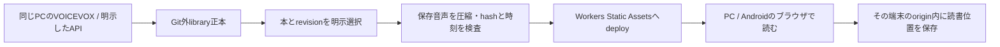

# ローカル音声生成・公開デモ・個人用Worker

更新日：2026-10-07 UTC。採用方針はローカルPCでの音声生成と、公開デモ／本人の個人用Workerでの閲覧です。後半のクラウド生成は将来案で、現在の配布機能には含めません。正本・再生成防止の詳細は[ローカル生成の契約](local-generation.md)、選択配布の手順は[静的配布](distribution.md)、実行結果は検証記録を参照してください。

## 現在の機能分担

| 機能 | 同じPCのlocal版 | Workersに配置する静的版 |
| --- | --- | --- |
| MD・TXT・貼り付け・対応PDFの取り込み、BudouX、RSVP | ブラウザ内で処理 | 同じ処理を閲覧端末のブラウザ内で実行。取り込んだ原稿をWorkerへuploadしない |
| 青空文庫の全文・ルビサンプル | 同梱JSONを読む | 公開の同梱JSONを読む |
| VOICEVOX・ずんだもん生成 | Nodeサーバーから同じPCのloopback Engineへ接続 | 生成機能なし。保存済み音声の再生にはEngine不要 |
| Gemini等のAPIによる生成 | 設定済みのローカルNodeサーバーから送信。鍵はサーバーのみ | 無効。生成route/API・AI binding・TTS secretを含めない |
| 保存済み音声 | Git外libraryの原稿・元WAV・対応表を読む | 明示allowlistで選択した本文・manifest・対応表・M4Aのみ読む |
| 読書位置・取り込み文書の保存 | 当該ブラウザoriginのIndexedDB | 同じ機構。localhost版、HTTPS版、Androidはそれぞれ別保存 |
| libraryへの追加・更新 | 同じPCのサーバー／CLI | 選択してstage、build、再deployする |
| 双方向同期、クラウド生成ジョブ、クラウド蔵書 | 未実装 | 未実装 |

VOICEVOXのEngineは利用者PCに置く前提です。公開サイトから閲覧者PCのEngineや生成サーバーへ自動接続しません。静的版の「取り込み」はブラウザ処理であり、クラウド保存を意味しません。ブラウザ保存もPCの生成library正本の代わりにはなりません。

今回の専用プレビューは公開の青空文庫本文と約1分のずんだもん音声だけを対象にします。私用原稿・元PDF/MD・全library・元WAV・生成query・job・env・秘密鍵を配布rootへ入れません。GitHubリポジトリのprivate設定とWorkerの閲覧範囲は別です。本人の個人利用はローカルに限定しません。[個人用Worker](../guides/personal-worker.md)へ選択した本文・音声・同期用対応表を配布してスマホで読めます。公開デモと入力・manifest・出力・Worker設定を分けます。個人用という名前は認証ではなく、閲覧を制限する場合だけ任意の[Accessとassetの保護](distribution.md#optional-accessとqr)を設定します。

## 選択したA案・C案と形式判定の実装

指定スレッドの前提・プロンプトと比較画面を確認し、3項目を実装しました。検証記録にlocal・Pages・公開Workerでの結果を記録します。クラウド生成APIは将来案のままです。

| 対象 | 現在の表示と動作 |
| --- | --- |
| C：公開版のVOICEVOX | 「公開版」「VOICEVOX · ローカルPC版限定」と無効な操作を表示。「音声生成はローカルPC版で利用できます」と理由を示し、折りたたみ説明でPC上のripolaとEngineを使う版だと案内。スマートフォンや公開ページを開いたPCで生成できるとは示さない |
| C：localの利用状態 | 音声設定を開くと確認中→最終確認結果と時刻。未接続時は声と生成内容の確認を無効にし、原稿を保って「接続を再確認」。確認中・失敗も生成を無効にする。黙読・保存済み音声は独立して利用できる |
| Gemini/Gateway | localのみ。「サーバー設定あり／設定が必要」は合成成功の表示ではない。有料への自動切替を行わず、本文・送信先・費用の確認を維持。publicには生成フォーム・API・有料開始CTAを配置しない |
| A：試す入口 | フォーム下の一つのpanelに、音声の冒頭約1分・短い黙読・全文11章の3行を常時表示。3つとも44px以上のsecondary actionから直接開く。mobileは縦積み。全文を折りたたまない |
| 音声サンプル取得失敗 | 行を消さず、取得できない理由と再確認を表示。本文サンプルの入口は使える。catalogから確認できた承認済みbook/revisionだけをリンクする |
| 貼り付け形式 | 自動判定が既定。「形式：自動判定 · テキスト／Markdown」と「変更」を表示。手動でテキスト・Markdown・自動判定へ変更でき、本文と選択を音声設定の開閉で保持する |
| ファイル形式 | TXTは文字をそのまま、MD/MarkdownはMarkdown、PDFと青空文庫HTMLは専用取込。取込結果を表示し、PDF/HTMLは元形式を保持。本文を編集すると貼り付けとして再判定。取込失敗では直前の原稿・PDFを維持する |
| 本棚・保存・名前 | localの入口は「このPCの本棚」。公開の保存音声は配布された本だけ。ブラウザ保存はorigin別。通常文書の端末内タイトル変更とlocal音声のmetadata更新を維持し、公開音声の管理APIを追加しない |

### 状態確認の契約

localの確認は既存の設定取得とEngineの`/speakers`によるread-only確認です。HTTP200の設定応答自体をEngine成功と扱わず、DTOの`voicevox.available`を使います。確認時刻は結果を受け取った端末時刻で、今後も接続が続く保証ではありません。遅い過去応答をrequest sequenceで無視し、音声設定の閉開・unmount後に古い状態を反映しません。再確認から合成・job開始・課金へ進みません。

公開版の利用状態はbuild profileによる機能範囲の表示です。閲覧者のloopback Engineを探索せず、local serverFnをimportしません。公開に「このPCでのみ利用できます」という曖昧な文言は使わず、**ローカルPC版**を指します。C比較案に描かれた公開Gemini生成は採用していません。

### 自動判定の範囲

貼り付けは見出し・fence・リスト・引用・リンク・太字・inline code・table separator・rubyの手掛かりがあればMarkdown、それ以外はテキストにします。単独の`#記号`、`C#`、`a*b`、`snake_case`や`---`だけではMarkdownにしません。あらゆるMarkdown文法や利用者の意図を推測する機能ではなく、曖昧な入力は「変更」で明示します。解析前の入力を書き換えず、選んだ形式だけで既存の抽出・分割に渡します。

ファイルは対応する拡張子を入口にし、PDF/HTMLを既存importerで検査します。PDFは横書き1段・テキスト層ありのみ。OCR、画像PDF、縦書き・段組の復元、一般HTMLを青空文庫本文として扱う拡張は追加していません。ファイル20 MB・本文100万文字の制限も維持します。

## 現在の配布は一方向

Static Assetsはdeploy時にuploadする完成資材です。今回の公開プレビューには音声Rangeだけを補うWorkerと一時的な配信cacheもありますが、生成・永続保存・同期の機能ではありません。[静的配信の仕組み](https://developers.cloudflare.com/workers/static-assets/)は、local libraryとの自動同期や実行中の生成物保存APIを提供するものではありません。本の追加・更新・削除は再stage/build/deployで反映します。変更のない音声は完成キャッシュから利用し、圧縮やdeployの失敗ではTTSを呼び直しません。

同じbook/revisionのURLをQRで開けても、localhostのIndexedDBとスマホのIndexedDBは転送されません。現状の音声デモは公開先のmanifestから開き、閲覧者の端末内で再生位置を保存します。Worker削除・再deployはlocal正本を変更しません。Static Assetsの配信コピーをバックアップ正本と扱いません。

## API生成をクラウドへ移すために必要なもの

これは将来案です。Gemini等はHTTPS APIなので、対応するWorker用adapterを実装すればサーバー側から呼べる候補です。ただし現在の生成coreはNodeのファイル保存・lock・ローカルprocessに依存しています。そのままWorkerへ配置して動くとは扱いません。VOICEVOXやローカルPython/ffmpegはWorker内で起動する構成にしません。

| 必要な責務 | 最小の追加案 |
| --- | --- |
| 呼び出し元の確認 | 所有者を認証する生成API。user/book/jobごとの権限を検査し、公開Readerと有料生成を分離 |
| 秘密鍵 | Worker Secret等でサーバーだけが保管。ブラウザbundle、manifest、QRへ入れない |
| 計画と課金 | exact発話原稿、provider/model/voice、対象差分、概算と上限を確認して開始。rate/quotaを制限 |
| 長い処理と再開 | 永続jobとchunk別attemptを管理。Queue/Workflow等のexecutorを使う案を評価し、HTTP応答やタブ寿命へ結び付けない |
| 完成ファイル | R2等のobject storageに原稿artifact、元音声、圧縮音声、対応表、manifestを永続保存 |
| 状態・排他 | 小さいD1等の台帳でoperation ID、speech key、状態、所有者、leaseを管理。音声本体をDBへ格納しない |
| 読書・download | 認証付き配信、Range、権利・voice帰属、検証済みexportを用意する |

Workerの[filesystem](https://developers.cloudflare.com/workers/runtime-apis/nodejs/fs/)を生成正本の永続保存先にしません。R2は、deployと独立した本の追加やクラウド生成が必要になってから導入する拡張です。現在はR2・D1・Queue・有料公開APIを作りません。実際のprovider API・音声形式・timeout・利用条件と費用を実接続前に再確認します。

将来、PCM変換・CTC・AAC圧縮をローカルへ戻す設計も可能です。その場合はクラウドで元音声と確定原稿を保存し、PCが明示downloadして後処理します。整列／圧縮が失敗しても保存済み元音声を再取得し、有料合成を再実行しません。

## 保存物の同一性と同期の台帳

以下の追加フィールドと操作は未実装です。現在のschemaを勝手に拡張せず、実装時にversionを上げてmigrationを用意します。公開の配布DTOと、所有者用の復旧exportは分けます。

| 対象 | 比較に使う情報 | 同一性の扱い |
| --- | --- | --- |
| 本 | stable book ID、document/revision hash、schema・分割version | タイトルや更新日時だけで同じ本と判定しない |
| 表示原稿 | artifactのSHA-256、UTF-16元範囲、ルビ、schema | byte/hash不一致は別revision。元ファイルの保存は別の選択 |
| 合成入力 | provider/engine version、model、voice、exact spokenText、辞書・正規化version、合成条件からspeech key | localとcloudで同じcanonical keyを使う。表示テーマやURLは含めない |
| 元音声と圧縮音声 | それぞれのSHA-256、byte数、形式、実duration、生成attempt | M4Aを元WAVと同一扱いしない。同じ合成入力の異なる出力は別artifactとして保持 |
| alignment・Reader map | 元audio hash、発話hash、aligner/規則version、元位置、精度 | 対象の音声・原稿が一致した結果だけ再利用 |
| manifest | manifest hash、順序付きartifact参照、完成chunk数、parent manifest hash | 全参照を検証した後に完成revisionとして確定 |
| 同期の記録 | serverUpdatedAt、uploadedAt、downloadedAt、localVerifiedAt、相手側manifest hash、lastSyncedManifestHash | timestampは履歴・差分候補。時計のずれがあるので内容の一致や競合解決の根拠にしない |

SHA-256は内容の照合に使います。R2のETagを任意の音声のSHA-256と同一視しません。[R2 API](https://developers.cloudflare.com/r2/api/workers/workers-api-reference/)の条件付きwriteは競合検査に使える候補ですが、audio・manifest・jobの複数objectを一括transactionにする機能とは扱いません。

immutable artifactを先に保存し、hash・durationと参照を検査してからmanifestを確定します。最後にcatalogのheadを親hashまたは台帳version付きのcompare-and-setで更新する案です。Readerは完成manifestだけを読むので、upload途中の音声や未完成mapへ切り替わりません。

## クラウドからローカルへ持ち帰る案

最初は「このbook/revisionをdownloadする」という明示操作にします。認証済みの所有者exportから、原稿・exact発話原稿と辞書・元音声・完成cache・対応表・manifest・必要なattempt/usage記録をまとめて取得します。鍵・token・任意のlocal絶対pathは含めません。公開DTOはprivateの合成入力や元WAVを除くため、それだけをdownloadして生成キャッシュを完全復旧できるとは説明しません。

PC側は新規の一時directoryでschema、path、size、hash、durationと参照を検査します。任意path・symlink・root外参照を拒否し、検証したartifactだけを既存libraryのlockの下で追加して完成状態を確定します。同じhashは再取得・再生成を省きます。未完成downloadを完成cacheに登録しません。持ち帰った音声を読むためにTTSへ接続しません。

同じbookのlocalとcloudが共通の親revisionから別々に更新された場合は、両方のrevisionを残して利用者が採用する方を選びます。更新時刻だけで片方を上書きしません。catalog更新の競合は再取得して解決し、片側の削除を相手へ自動伝播しません。将来の削除同期には確認とtombstoneの保管期間を別に設計します。読書位置の同期も本文同期とは分け、同じbook/revisionの位置だけを比較します。

## 二重課金と段階的な追加

1. **現在：local生成＋選択的静的配布。** R2不要。公開サンプルを実ホストで確認し、private library正本はlocalに保持し、選択したコピーを本人の個人用Workerへ配布してスマホで閲覧する。
2. **次：明示export/import。** ファイルの復旧形式、schema/hash検査、既存完成cacheの再利用を先に実装。自動双方向同期を始めない。
3. **必要になった時：認証付きobject配布。** R2等で本の追加をdeployから分離。catalogとmanifest、条件付き更新、Range、所有権、downloadを実装する。
4. **その後：明示したAPI生成。** 確認済みplan、永続job・排他・費用上限を用意し、有料実合成は別途許可して検証する。

クラウドjobの二重開始はoperation IDとspeech keyを台帳の一意制約・leaseで抑止します。ただしproviderへ送信した後に通信やexecutorが落ちた場合、provider側のidempotencyが保証されていなければ「厳密に1回の課金」は保証できません。`outcome-unknown`を保存し、request ID・結果照会機能・元音声の保存状態を照合します。結果不明の有料chunkをQueueのretryで自動再送せず、追加課金の可能性を示して明示判断を求めます。

alignment、map、圧縮、upload、download、deployは完成元音声から再試行します。modelやvoiceの変更で再生成する時は別key・新revisionにし、保存物を暗黙に置き換えません。この契約をlocal/cloudの両入口で共有してから同期範囲を広げます。
